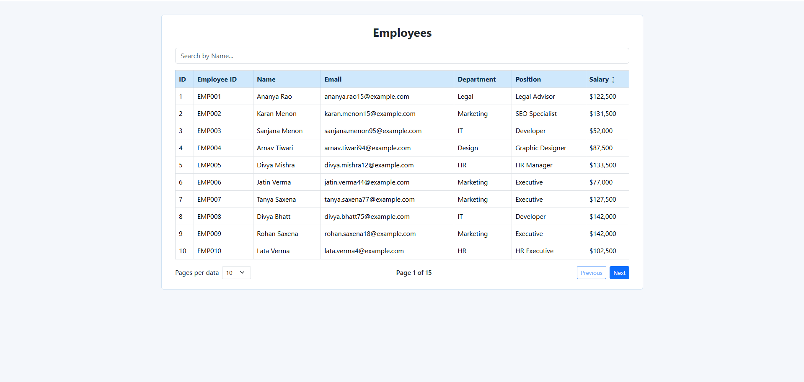
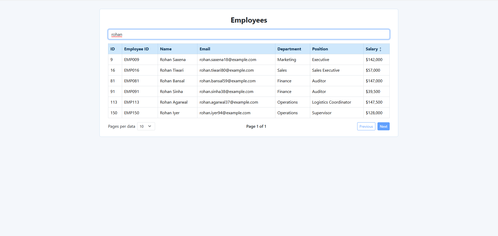

# Employee Data Table

A responsive React component that displays 150 employee records in a Bootstrap table, with name search, salary sorting and pagination. Data is served by a local `json-server` API. The project does not use `localStorage` or `useMemo`.

## Output

### Employee Table

### Table View


### Search / Pagination View


## Features

- **Data source:** records are fetched on mount from `http://localhost:5000/employees` (json-server, backed by `db.json`).
- **Columns:** ID, Employee ID, Name, Email, Department, Position and Salary.
- **Search:** one input that filters by **Name only**, using `event.target.value`.
- **Sorting:** **Salary only**. Click the Salary header to toggle between low-to-high (▲) and high-to-low (▼). The header shows ↕ before any sort is applied.
- **Pagination:**
  - Left: "Pages per data" dropdown (5, 10, 20, 30, 50, 100, 150).
  - Center: current position, for example "Page 1 of 15".
  - Right: **Previous** and **Next** buttons, disabled at the first and last page.
- **Styling:** light blue header and white data rows, built with Bootstrap.

## Tech Stack

- React 18
- Vite
- Bootstrap 5
- json-server 0.17 (mock REST API)

## Project Structure

```
employee-data-table/
├── output/            # Screenshots used in this README
│   ├── output1.png
│   └── output2.png
├── src/
│   ├── main.jsx       # App entry, loads Bootstrap and global CSS
│   ├── App.jsx        # Employee table component
│   └── index.css      # Table and layout styles
├── db.json            # 150 employee records served by json-server
├── index.html
├── package.json
├── vite.config.js
└── README.md
```

## Getting Started

### Prerequisites

- Node.js 18 or newer (check with `node -v`)

### Install

```bash
npm install
```

### Run

```bash
npm start
```

This starts both servers at once:

| Service | URL |
| --- | --- |
| json-server API | http://localhost:5000/employees |
| React app (Vite) | http://localhost:5173 |

To run them separately in two terminals:

```bash
npm run api   # json-server on port 5000
npm run dev   # Vite dev server
```

Press `Ctrl + C` in the terminal to stop.

## Available Scripts

| Command | Description |
| --- | --- |
| `npm start` | Runs the API and the dev server together |
| `npm run api` | Runs json-server on port 5000 |
| `npm run dev` | Runs the Vite dev server |
| `npm run build` | Creates a production build in `dist/` |
| `npm run preview` | Previews the production build |

## How the Table Works

All state lives in `App.jsx` using `useState`: `data`, `searchQuery`, `sortDirection`, `currentPage` and `rowsPerPage`.

On every render the data goes through this pipeline using native array methods, without memoization:

1. `.filter()` keeps the records whose Name matches the search query.
2. `.sort()` orders the filtered results by Salary.
3. `.slice()` extracts the rows for the current page.
4. `.map()` renders the rows in the JSX.

Changing the search text, the sort order or the rows per page resets the table to page 1.

## Data Format

Each record in `db.json` looks like this:

```json
{
  "id": 1,
  "employeeId": "EMP001",
  "name": "Ananya Rao",
  "email": "ananya.rao15@example.com",
  "department": "Legal",
  "position": "Legal Advisor",
  "salary": 122500
}
```

## Troubleshooting

- **"Could not load employees" with status 404:** another json-server (for example from a different project) is already using port 5000. Stop it with `Ctrl + C` in its terminal, or run `taskkill /F /IM node.exe` in a Windows terminal, then run `npm start` again.
- **`EADDRINUSE` error:** port 5000 or 5173 is already taken. Close the other app, or change the port in the `api` script in `package.json` and in `API_URL` in `src/App.jsx`.
- **`npm is not recognized`:** install the Node.js LTS version from nodejs.org, then restart VS Code.